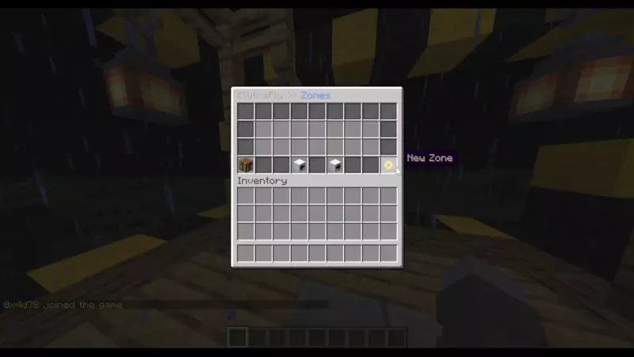
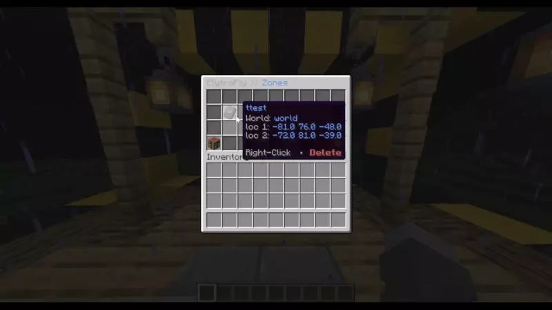
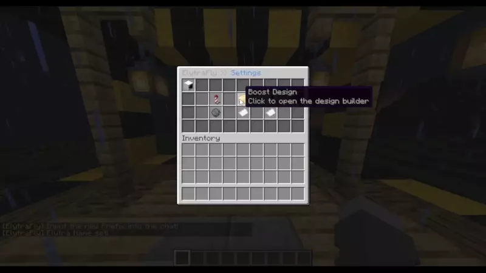
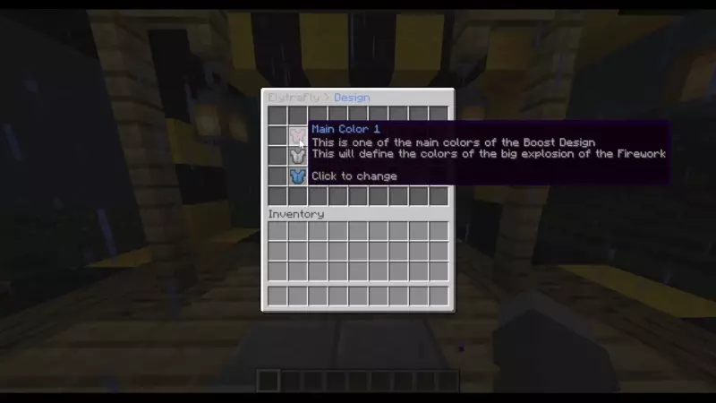

# ElytraFly
> Simple One-time-use elytra Plugin offering multiple elytra zones 

## Setup
Download the Plugin, put it in `plugins/` and restart the server

## Creating Zones
> Zone define the areas in which Players get the elytras. 

To create a Zone, open the GUI with `/elytrafly` and click on `New Zone`. Follow the Instructions in the Chat to create the Zone

## Deleting Zones
To delete a Zone, simply right-click the Zone in the Zone GUI, opened with `/elytrafly`, to delete it.

## Configuration
Everything there is to configure about this Plugin is done in the GUI opened with `/elytrafly`

To open the Settings, click on the Workbench in the lower left corner of the GUI

#### Boost 
If boost is activated, Player with the `elytrafly.boost` permission can use the `F` key to boost themselves in mid-air
#### Boost Strength
Boost Strength defines how long the Boost will last. every level is approximately half a second of boost
#### Boost Delay
How many seconds player have to wait until they can boost again
#### Prefix
Changes the Prefix of the Plugin
#### Elytra Name
Changes the name of the Elytra 

## Boost Designs
ElytraFly offers an extensive Design builder to customize the boosts to your liking. The Builder offers functionality to change colors, add fades, flickers and trails to your boosts.

### Colors
You can easily define the colors of your elytra just by clicking items!

## License
This Repository is licensed under `GPL v3`